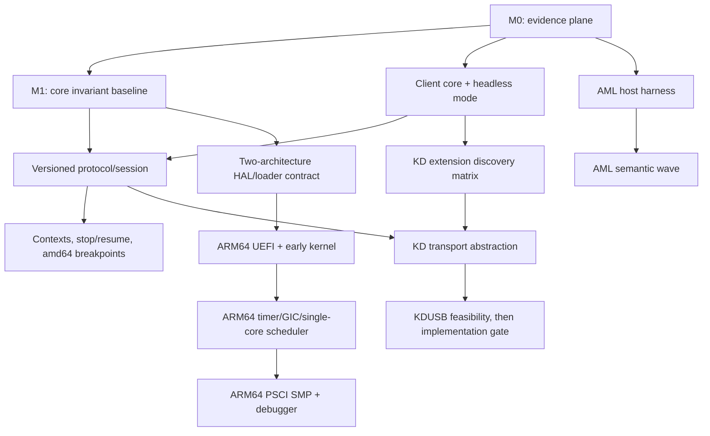

# Palladium next-major-period engineering roadmap

Status: repository-derived planning baseline, 2026-07-12. This directory is a roadmap, not a
claim that the described work is implemented.

This roadmap uses five evidence labels deliberately:

- **[CODE]** is established by the current repository at commit `3439f67`.
- **[SPEC]** is established by a linked primary specification or vendor architecture manual.
- **[OBSERVED]** is reserved for behavior measured from legally obtained proprietary modules.
  No such observation is treated as a specification in this roadmap.
- **[REC]** is an architectural recommendation.
- **[QUESTION]** is unresolved research whose answer may change a later design.

The companion plans are:

- [Debugger and KD](DebuggerAndKD.md)
- [ARM64 bring-up](ARM64.md)
- [ACPI and AML](ACPIAndAML.md)
- [Core correctness and verification](CoreCorrectnessAndVerification.md)

## 1. Executive assessment

Palladium is past the “boot a kernel and print text” stage but is not yet at the stage where broad
feature growth is cheap. It has a coherent PE/COFF-and-UEFI boot chain, an executive with SMP,
threads, waits, object directories, physical/virtual/pool allocation, an architecture-aware HAL,
a custom AML interpreter that already covers a substantial useful subset, a WDK-shaped KDNET
extension adapter, and purpose-built CRT/RT layers. Recent history is unusually valuable evidence:
the commits immediately before this roadmap repair scheduler accounting, object/alert edge cases,
partial pool expansion cleanup, PE validation, CRT edge cases, and ACPI reference semantics. That
is a strong foundation and also a signal that the next period should make correctness observable,
not simply add more surface area.

The largest risks are:

1. **There is no repeatable execution evidence plane.** CI builds images but does not boot them;
   `run.sh` is an interactive, mutable, KVM/host-CPU-oriented workflow; and there is no test tree.
   Debug output normally depends on the very KD path that needs development, including an
   externally supplied proprietary extension.
2. **Core invariants are real but mostly implicit.** PFN accounting, per-CPU caches, pool bitmap
   ownership, scheduler queue membership, wait/signal races, object reference ownership, IRQL and
   page-map cleanup cross subsystem boundaries. A clean build does not exercise these invariants.
3. **The current debugger cannot resume a stopped target.** The client has presentation, protocol,
   request state, and socket I/O intertwined; the wire format has no version, session, sequence,
   status, or capability model; and the target’s receive loop is intentionally terminal after a
   break. Breakpoints cannot be safely layered on that state model.
4. **AML breadth exceeds its verification.** The opcode argument tables recognize operations that
   have no handler, malformed data can reach fatal policy, method invocation is recursively
   re-entered without a depth budget, and field/reference semantics have no isolated oracle.
5. **`amd64` is embedded in contracts, not only mechanisms.** The loader block, page-map handoff,
   `KeProcessor`, interrupt context, IRQL representation, timer/APIC/SMP bootstrap, debugger port
   I/O, atomic SLists, and unwind implementation all need explicit two-architecture seams before
   ARM64 can be more than a parallel source tree.

The three highest-leverage investments are therefore:

1. **A deterministic evidence plane:** separable image construction, non-proprietary QEMU smoke
   boot, structured boot diagnostics, host tests for pure code, and a headless debugger frontend.
2. **A resumable, versioned debugger state machine:** client-core separation and protocol hardening
   first, then contexts, stop reasons, continue/step and amd64 software breakpoints.
3. **Executable invariants:** bounded static-analysis triage and focused memory, wait/scheduler,
   object, AML, CRT and RT harnesses before architecture expansion.

ARM64 remains the right next architecture. It should start after the HAL/loader contracts have
been written down and exercised on amd64, not after every amd64 feature is finished. KD extension
discovery can be generalized independently and relatively early; KDUSB cannot responsibly be
scheduled as an implementation until a transport seam and a hardware/module feasibility result
exist.

## 2. Repository architecture map

### Firmware to kernel

1. UEFI enters `OslMain` in `src/boot/osloader/main.c`. It saves EFI globals, disables the
   watchdog, checks CPU support, obtains entropy, opens the boot volume, initializes the loader’s
   virtual allocator, discovers ACPI and GOP, and parses `\EFI\PALLADIUM\BOOT.CFG`.
2. `OslLoadExecutable` in `src/boot/osloader/loader.c` loads `KERNEL.EXE`, boot drivers, and—when
   debugging is enabled—a KD extension. `OslFixupImports`, `OslFixupRelocations`, and
   `OslCreateKernelModuleList` establish the PE image graph. The loader permits no imports in the
   proprietary extension and expects the single export `KdInitializeLibrary`.
3. Loader allocation and amd64 page-table construction live in `src/boot/osloader/memory.c`,
   `descriptors.c` and `src/boot/osloader/amd64/page.c`. `OslpBootBlock` in
   `src/boot/osloader/include/platform.h` is packed and mirrored by `KiLoaderBlock` in
   `src/kernel/include/private/kernel/detail/kitypes.h`; its version is currently 6. The block
   carries memory descriptors, module lists, framebuffer data, ACPI roots, boot time and debug
   adapter data. Its architecture member is initialized by `OslpInitializeArchBootData`.
4. `OslpTransferExecution` in `src/boot/osloader/amd64/transfer.c` refreshes the firmware memory
   map, retries `ExitBootServices` on a stale map key, disables interrupts, establishes amd64
   control-register state and transfers via the Microsoft x64 ABI to `KiSystemStartup`.

The current four-level virtual layout is authoritative in `docs/amd64/AddressSpace.txt`: early
kernel mappings, pool bitmap, PFN database, loader mappings, 128-GiB pool space, and the recursive
PML4 area occupy separate high-half regions. [CODE] The PE image and machine contracts must remain
consistent with the [Microsoft PE/COFF format](https://learn.microsoft.com/en-us/windows/win32/debug/pe-format),
while firmware entry and handoff are governed by [UEFI 2.11](https://uefi.org/specs/UEFI/2.11/).
[SPEC]

### Kernel initialization and runtime layers

`KiSystemStartup` in `src/kernel/ke/entry.c` has boot-processor and application-processor paths.
`InitializeBootProcessor` initializes random state, video, the early page allocator,
`HalpInitializePlatform`, and `KdpInitializeDebugger`; it then initializes pool/PFN accounting,
retains the ACPI and module data, releases loader memory, initializes the boot processor and APs,
creates idle/system threads, and enters scheduling. AP entry is reached through
`src/kernel/hal/amd64/smp.S` and `HalpInitializeApplicationProcessor`.

The HAL is split between common `src/kernel/hal/*.c` and amd64 mechanisms under
`src/kernel/hal/amd64/`. It owns early ACPI table access, four-level mapping, CPUID/platform
validation, GDT/IDT and exception entry, local APIC and I/O APIC, TSC/HPET/APIC timers, PCI config,
IRQL/interrupt dispatch and INIT/SIPI SMP start. Public driver-facing calls are declared under
`src/kernel/include/public/kernel/detail/halfuncs.h`; private initialization and mapping calls are
in `.../private/kernel/detail/halpfuncs.h` and its `amd64` detail header.

The executive layers are:

- `src/kernel/mm`: early physical descriptors, `MiPageEntry` PFN database, page allocation,
  virtual-space bitmap, pool buckets/per-CPU caches, mapping and tracking.
- `src/kernel/ev`: `EvHeader` wait objects, signals, recursive mutexes, timeouts and timer ticks.
- `src/kernel/ps`: `PsThread`, per-processor runnable and expiration queues, context switching,
  alerts, suspension, termination and scheduler/DPC work.
- `src/kernel/ob`: reference-counted object headers and directory membership rooted at
  `ObRootDirectory`.
- `src/kernel/ke`: startup, IRQL/spin locks, processor synchronization, work items, drivers,
  randomness and fatal handling.
- `src/kernel/vid`: framebuffer/ring-buffer diagnostics and fatal screen.
- `src/kernel/kd`: proprietary extension imports/exports, controller polling, Ethernet/ARP/IPv4/UDP,
  custom Palladium debugger protocol and `KdPrint`.

`KiContinueSystemStartup` calls the saved boot-driver entry points through
`KiRunBootStartDrivers` and then stops forever. [CODE] This is an intentional current boundary:
there is no user-mode launch, I/O manager, dynamic driver load/PnP/power stack, filesystem or disk
boot path. It should be described as absent, not papered over with Unix process/device concepts.

The only boot driver is the custom `src/drivers/acpi`. Its table layer maps and validates firmware
tables; its namespace/interpreter layer parses DSDT/SSDT AML into `AcpiObject`/`AcpiValue`; opcode
families implement expressions, fields, named objects, synchronization and statements; region
adapters implement SystemMemory, SystemIO, PCI configuration, EC and CMOS; and its public API is
listed in `src/drivers/acpi/acpi.def`.

The shared runtime is intentionally layered. `src/sdk/crt/{ctype,math,stdio,stdlib,string}` supplies
freestanding C operations, with target-specific selection/additions in its CMake target-kind files
and OS layer. The root of `src/sdk/rt` supplies lists, AVL trees, bitmaps and hashing; kernel RT adds
amd64 context, exception and unwind machinery.
Exports in `*.def`, public headers, packed blocks and assembly/C layout pairs are ABI surfaces.

### Diagnostics and host client

The Python package `src/debugger` connects over UDP. `connection.py` performs the handshake;
`receiver.py` decodes replies and prints; `command.py` tokenizes and sends reads/disassembly/port
commands; `protocol.py` contains packet constants and one global outstanding-operation state;
`interface.py` owns curses; and `main.py` polls all of them. The target protocol in
`src/kernel/kd/protocol.c` currently supports connect, print, break, physical/virtual reads and
x86 port reads. The early connection waits; a later break enters `KdpEnterReceiveLoop` without a
resume transition. Detailed consequences are in [Debugger and KD](DebuggerAndKD.md).

## 3. Capability and gap inventory

| Area | Exists and appears functional | Partial or absent | Difficult to verify / risk | Debt versus design |
|---|---|---|---|---|
| Build | C23 CMake/Ninja, Clang/LLD PE targets, compiler-rt bootstrap, Release CI images | One accepted `amd64` architecture; no test targets; duplicated image logic | Release CI never boots; local compiler-rt/firmware/tool paths vary | Single architecture is current scope; duplicated/non-hermetic verification is debt |
| UEFI loader | GOP, ACPI, configuration, PE imports/relocations, loader page map, boot drivers | Ordinal imports unsupported; relocation default is not a hard rejection; fixed KDNET discovery; no ARM64 | Malformed PE/config arithmetic; mandatory graphics; packed handoff lacks consumer validation | PE/UEFI custom loader is intentional; unchecked/fixed assumptions are debt |
| HAL amd64 | APIC/IOAPIC, IDT/GDT, TSC/HPET, PCI config, SMP and page maps | Contracts mix executive and amd64 storage; freeze is panic-oriented, not reversible debug rendezvous | IRQL/interrupt/lock assumptions and real-hardware breadth | Mechanisms belong in amd64; public `KeProcessor` shape is architecture debt |
| MM/pool | PFN, physical/page/pool allocators, tags/tracking, mappings, per-CPU caches | Cache reclamation TODOs; failure rollback and accounting need proof | Fragmentation, overflow, duplicate list membership, partial map cleanup | Custom MM is intentional; missing invariant tests/instrumentation are debt |
| Events/threads | signals, recursive mutexes, waits/timeouts, alerts, scheduler, SMP work/IPIs | No stress harness or state-transition specification | signal-vs-timeout, termination, queue membership and lock/IRQL races | Executive model is intentional; implicit ownership/state rules are debt |
| Objects | typed ref-counted objects and directories | No broader handle/security namespace; concurrent lookup/removal ownership is unclear | borrowed pointer lifetime after directory unlock; ref overflow/underflow | Small object model is an intentional stage; undocumented ownership is debt |
| KD target | external KDNET adapter, Ethernet/ARP/IPv4/UDP, print/read commands | no resume/context/breakpoints; fixed Ethernet discovery; incomplete extension imports | static buffers, size arithmetic, mapping cleanup, loss/replay, SMP stop ownership | Custom Palladium protocol is intentional; lack of state/version framing is debt |
| Python debugger | curses log/command UI, memory reads, Capstone disassembly, port reads/export | no headless mode, register/context, continue/step; client-only register constants | empty/truncated/wrong-peer datagrams, global single request, UI exceptions | TUI is useful; direct coupling and undeclared Capstone dependency are debt |
| ACPI/AML | tables/namespace, methods, values/references, control flow, conversions, packages/buffers, fields, mutex/events, several regions | Notify only traces; ConnectField fatal; Load/LoadTable/DataRegion/External handling missing or incomplete; several regions absent | recursive calls, unbounded loops/nesting, malformed AML fatal policy, reference/field bounds | Custom stack must remain; incomplete verified semantics are debt |
| CRT | useful ctype/string/stdio/numeric subset across target kinds | headers broader than implementations; wide formatting and several edge semantics absent | scanner/formatter arithmetic and clang-tidy findings | Freestanding subset is intentional; exports/documented surface must match reality |
| RT/unwind | lists, atomic SList, bitmap, AVL, hash; amd64 context/SEH/unwind | amd64-only unwind/context; some unwind-v2 and exception paths TODO | intrusive structure corruption, 16-byte atomic assumptions, generated unwind breadth | Small custom RT is intentional; missing property/ABI vectors are debt |
| Crypt | SHA-2 variants, generic hash API, HMAC and ChaCha20 in `src/sdk/crypt` | no signature-verification/secure-boot chain despite the stated future direction in history | no known-answer/property suite is present; side-channel behavior is unmeasured | A useful custom library, but verification must precede boot trust; not a near-term dependency |
| Driver/runtime | loader-resolved boot drivers, ACPI driver entry | no I/O manager, device/IRP model, dynamic load, PnP/power, user runtime startup | dependency/lifetime policy beyond boot drivers does not exist | An explicit maturity boundary, not an urgent rewrite target |
| Diagnostics/tests | framebuffer/KD messages, panic stack trace, local QEMU script | no serial/structured sink, unit tests, boot assertion, fuzz corpus or CI QEMU | proprietary KD module cannot be bundled; QEMU workflow mutates state | The largest current maintainability bottleneck |

Not every TODO is a roadmap item. For example, unsupported PE ordinal imports can remain rejected
until a Palladium-owned image needs them; missing wide stdio can remain outside the declared CRT
profile; and unimplemented AML operation regions should be prioritized by firmware corpus evidence,
not completeness theater. Conversely, `Notify` being a trace, an accepted AML opcode falling into
the fatal default, failure rollback, and packet length arithmetic are correctness issues even if
they are represented by small comments.

## 4. North-star milestones

### M0 — Reproducible evidence plane

An amd64 image is built once and booted headlessly with fixed QEMU machine/CPU/memory settings,
fresh disposable OVMF variables, bounded timeouts and captured diagnostics. CI can assert the
kernel banner, MM initialization, processor count and ACPI enablement without any proprietary
module. Debugger codec/session tests use a fake UDP target, and a local opt-in lane can supply
legally obtained KD modules outside source control.

### M1 — Trustworthy amd64 executive baseline

High-signal clang-tidy findings are classified; memory accounting/ownership assertions and
wait-thread-object transition invariants exist; focused SMP/fault-injection scenarios are
repeatable; and known cleanup/overflow/lifetime defects found by those tests are fixed in small
commits. The result is not “the kernel is proven correct”; it is an auditable invariant baseline.

### M2 — Resumable amd64 debugger

The Python client has one protocol/session core serving TUI and headless frontends. A negotiated
protocol has capabilities, correlation, status and architectural context. The target reports stop
reasons and per-CPU context, can continue and single-step, and supports target-owned amd64 `INT3`
software breakpoints including step-over, SMP quiescence and loss/reconnect policy.

### M3 — Testable initial-complete AML wave

The interpreter core runs in a host harness with fake OS/region services, a mechanical
recognized-versus-handled opcode report, namespace/evaluation golden tests, malformed/truncation
and allocator-failure tests, and explicit depth/execution budgets. The first missing semantic wave
is chosen from real/generated firmware corpus coverage and completes Notify plus the highest-use
recognized-but-unhandled operations without replacing the custom interpreter.

### M4 — Two-architecture contract and ARM64 UEFI entry

The build accepts separate amd64 and ARM64 target descriptions; loader/kernel handoff common and
architecture data are versioned; `KeProcessor`, interrupt context, page-map, CPU-local, IRQL and
context-switch boundaries have only the seams demanded by amd64 and ARM64. `BOOTAA64.EFI` loads an
ARM64 kernel and reaches an architecture-owned early entry in QEMU `virt`, while amd64 remains
green.

### M5 — ARM64 single-core executive, then platform parity

ARM64 establishes EL1 state, high-half page tables, exception vectors, Generic Timer and GIC,
enters the existing MM/executive, and schedules a system thread on one CPU. A later gate adds PSCI
SMP, interrupt routing, ACPI/PCI coverage and debugger context/stop support. These are separate
milestones because firmware and interrupt-controller research dominates uncertainty.

### M6 — Transport-independent KD

Extension discovery follows supported PCI class/vendor and DBG2 identities rather than one
filename family. The kernel debugger consumes a transport contract independent of the Palladium
protocol. Ethernet/KDNET is one adapter. Serial/USB feasibility is evidence-backed; KDUSB proceeds
only after a spike establishes hardware/emulator and legal module requirements.

## 5. Dependency graph and recommended order

The proposed order is close to the one in the request, with three changes:

1. **Extract client core/headless behavior before changing the wire format.** It creates a fake
   target and automated oracle that can validate the protocol transition. A small compatibility
   path can speak legacy v0 during the change; do not build more v0 commands.
2. **Start the AML harness alongside core auditing, not after breakpoint completion.** It is mostly
   host-isolated and immediately de-risks a boot-critical parser. The semantic expansion still
   waits for the harness and coverage report.
3. **Separate KD module discovery from transport implementation.** Microsoft’s public extensibility
   contract already establishes broader naming/classification, so loader discovery can advance.
   KDUSB remains after the transport seam and feasibility evidence.

Do not make ARM64 wait for every debugger command or AML opcode. It does depend on a stable loader
block policy, explicit architecture ownership, deterministic boot diagnostics, and core invariants
that distinguish generic failures from porting failures. Do not combine breakpoint work with the
HAL refactor: both touch interrupt/context/SMP code and would make regressions hard to attribute.

## 6. Epic index

The detailed epic plans—including objective/definition of done, files, decisions, phases, tests,
risks, dependencies, merge boundaries, prohibited combinations, model choice and subagent advice—
are distributed as follows:

| Epic | Detailed plan |
|---|---|
| Build and QEMU automation | [Core correctness and verification](CoreCorrectnessAndVerification.md#epic-v1-build-image-and-qemu-automation) |
| Debugger headless mode | [Debugger and KD](DebuggerAndKD.md#epic-d1-headlessscriptable-debugger) |
| Protocol cleanup/versioning | [Debugger and KD](DebuggerAndKD.md#epic-d2-protocol-cleanup-and-versioning) |
| amd64 breakpoint support | [Debugger and KD](DebuggerAndKD.md#epic-d3-amd64-breakpoints-stopresume-and-stepping) |
| Debugger command expansion | [Debugger and KD](DebuggerAndKD.md#epic-d4-command-expansion) |
| KD extension discovery/loading | [Debugger and KD](DebuggerAndKD.md#epic-k1-extension-module-discovery-and-loading) |
| KD transport abstraction | [Debugger and KD](DebuggerAndKD.md#epic-k2-kd-transport-abstraction) |
| KDUSB feasibility | [Debugger and KD](DebuggerAndKD.md#epic-k3-kdusb-feasibility) |
| AML test harness | [ACPI and AML](ACPIAndAML.md#epic-a1-hosted-aml-test-harness) |
| Missing AML semantic wave | [ACPI and AML](ACPIAndAML.md#epic-a2-missing-aml-opcode-and-semantic-wave) |
| Core memory audit | [Core correctness and verification](CoreCorrectnessAndVerification.md#epic-c1-memory-audit) |
| Events/threads/scheduler/objects | [Core correctness and verification](CoreCorrectnessAndVerification.md#epic-c2-events-threads-scheduler-and-objects) |
| CRT/RT audit | [Core correctness and verification](CoreCorrectnessAndVerification.md#epic-c3-crt-and-rt-audit) |
| HAL architecture contract | [ARM64 bring-up](ARM64.md#epic-r1-hal-and-loader-architecture-contract) |
| ARM64 UEFI loader | [ARM64 bring-up](ARM64.md#epic-r2-arm64-uefi-loader) |
| ARM64 early kernel/HAL | [ARM64 bring-up](ARM64.md#epic-r3-arm64-early-kernel-and-single-core-hal) |
| ARM64 interrupts/timer/SMP/debugger | [ARM64 bring-up](ARM64.md#epic-r4-arm64-interrupts-timer-smp-and-debugger) |

Model guidance is deliberately task-specific. As of this roadmap, OpenAI describes GPT-5.6 Sol as
the flagship for complex reasoning/coding, Terra as the balanced default, and Luna as the
high-volume option; available reasoning levels are documented on the
[official model page](https://developers.openai.com/api/docs/models). [SPEC] In these plans, use
Sol/high for ABI, concurrency and implementation with cross-subsystem consequences; Sol/xhigh for
architecture bring-up, debugger exception ownership, unwind and ambiguous AML semantics; Sol/medium
for bounded implementation after a design is frozen; and Luna/xhigh for independent inventory,
test-vector generation and review. Max reasoning is an escalation for an actual spec/code
contradiction, not a default.

## 11. Twelve-week and longer-term roadmap

This is a sequence for a serious hobby project, not an elapsed-time promise. Hardware access,
proprietary-module investigation and architecture specifications create larger uncertainty than
coding volume.

### First two weeks — foundation milestone

- Split image construction from VM execution and make outputs disposable and parameterized.
- Add a fixed QEMU amd64 smoke profile with timeout, captured diagnostics and explicit success
  markers; keep a non-proprietary default lane.
- Add a host test entry point for Python debugger codec/command parsing with a fake UDP target.
- Extract a frontend-neutral debugger session/event core and add minimal headless text/JSONL output.
- Record the current clang-tidy findings in a generated artifact/CI log and classify the first
  high-signal issues; do not mass-fix warning families.

Acceptance is one command that builds and deterministically reports pass/fail for a non-debug amd64
boot, plus host tests that prove malformed debugger datagrams do not crash the client. If a serial
diagnostic sink is needed to make that possible, it belongs in this milestone and must not be tied
to a Unix terminal abstraction.

### Weeks 3–6 — trustworthy state transitions

- Freeze the v1 debugger envelope/capability/context RFC and build pure Python/C codec vectors.
- Add target packet validation, exact lengths, overflow-safe ranges, peer/session correlation and
  structured errors; preserve a narrow v0 connection path only while migration is active.
- Instrument page/pool accounting, mapping rollback and per-CPU cache membership; add allocation
  fault injection and fixed 1/2/4-CPU stress profiles.
- Specify scheduler/thread/wait state transitions and test signal-timeout, alert and termination
  races.
- Land the hosted AML parser/evaluator skeleton, fake operation regions and opcode coverage report.

At week 6, the project should be better at rejecting bad inputs and explaining failures even if no
new user-visible kernel feature has shipped.

### Weeks 7–12 — debugger milestone plus AML evidence

- Add architectural context and stop-reason serialization, reversible SMP quiescence and
  continue/stop semantics.
- Add amd64 software breakpoint table, `INT3` exception ownership, internal step-over and explicit
  single-step; test disconnect/reconnect and simultaneous hits.
- Add register/context and breakpoint commands to both headless and TUI frontends, then memory
  write only if breakpoint patching has established a safe target primitive.
- Complete AML malformed/truncation, reference-balance, depth/fuel and generated-ASL golden tests.
- Implement Notify dispatch and the first corpus-justified recognized-but-unhandled AML operations;
  leave unsupported operation regions explicit.
- Draft and review the two-architecture loader/HAL contract and create compile-only ARM64 target
  scaffolding if it can be done without weakening amd64 gates.

The credible 12-week outcome is a reliable resumable amd64 debugger, executable core invariants,
and a testable AML wave. ARM64 firmware entry is a stretch outcome, not part of the definition of
done for this period.

### Longer term

1. ARM64 `BOOTAA64.EFI` to early kernel banner on QEMU `virt`.
2. ARM64 high-half mappings, exceptions, Generic Timer, GIC and single-core scheduler.
3. PSCI SMP, ACPI MADT/GTDT and PCI ECAM parity; then ARM64 debugger contexts and breakpoints.
4. KD extension compatibility matrix and generalized PCI/DBG2 discovery.
5. Transport adapter split; serial feasibility and KDUSB/xHCI Debug Capability research.
6. Driver lifecycle RFC (device identity, ownership, unload/PnP/power boundaries) only when a
   second real driver or post-boot device use supplies concrete requirements.
7. User execution, storage and I/O architecture as separate future programs, not incidental ARM64
   or debugger work.

## 12. Immediate next actions

Each item is intended to fit one focused engineering session.

1. **Create a boot-evidence contract.** List exact required markers and failure markers from one
   known-good amd64 boot. Acceptance: a checked-in text specification names banner, MM, processor
   and ACPI markers, timeout and exit interpretation without requiring KD.
2. **Make QEMU state disposable.** Add a runner mode using a fresh copy of OVMF variables, fixed
   `-smp`/memory/CPU model and a per-run output directory. Acceptance: two consecutive runs do not
   reuse mutated firmware state or overwrite source/build artifacts.
3. **Write debugger datagram tests around current behavior.** Cover empty, truncated, oversized,
   wrong-type and wrong-peer packets. Acceptance: host tests terminate deterministically and no
   Python exception escapes the session loop.
4. **Extract a frontend-neutral debugger event sink.** Replace direct receiver-to-curses calls for
   connection, print and response events. Acceptance: the same fake packet trace produces
   equivalent TUI events and headless JSONL without importing curses in the headless process.
5. **Write the v1 protocol RFC and golden byte vectors.** Acceptance: header fields, endianness,
   exact-length rule, limits, capabilities, status, session/sequence behavior and v0 transition are
   specified, and Python can round-trip every vector before kernel code changes.
6. **Triage ten high-signal clang-tidy findings.** Start with loader file-info nullability, KD BAR
   indexing and print length/lock state, pool list indexing, AML undefined/64-bit shifts, RT AVL and
   unwind, and scanner pointer arithmetic. Acceptance: each is classified as defect, analyzer
   limitation or intentional low-level pattern with a reproducer/justification; no blanket ignores.
7. **Document memory-accounting equations.** Acceptance: page states, global/per-CPU cache
   ownership, pool bitmap ownership and every counter transition are mapped to functions and lock/
   IRQL requirements.
8. **Create an AML recognized/handled report.** Mechanically compare `interp/args.c` valid entries
   with all opcode-family handlers. Acceptance: every recognized operation is marked implemented,
   partial, deliberate reject or accidental fatal fallthrough.
9. **Build the smallest hosted AML parse test.** Acceptance: a generated minimal table constructs a
   namespace, evaluates one method, uses a fake allocator/diagnostic adapter and returns an error
   rather than invoking kernel fatal policy.
10. **Draft the loader-block v7 compatibility policy.** Acceptance: common versus architecture
    fields, magic/version validation, size/alignment and forward/backward rejection behavior are
    written down with compile-time layout assertions; implementation is a later task.

## 13. Blocking questions

These questions materially alter architecture or ordering; everything else can be decided from
the repository and specifications.

1. **Must CI run only on hosted GitHub runners, or can a self-hosted runner provide KVM, OVMF and
   legally obtained KD modules?** This decides whether the debugger-in-QEMU lane is a CI gate or a
   documented local/nightly gate. Proprietary modules must never be checked in or uploaded either
   way.
2. **What is the debugger-loss policy for a stopped production target: remain stopped indefinitely,
   fail open after a timeout, or make this a boot option?** This determines target breakpoint
   ownership, watchdog behavior and whether reconnect is safety-critical.
3. **Is ARM64’s first concrete platform QEMU `virt` with UEFI+ACPI, or is a specific physical board
   an early requirement?** This decides GIC version, PSCI conduit, PCI ECAM, ACPI versus device-tree
   scope, and how much platform abstraction is justified. The roadmap assumes QEMU `virt`, UEFI
   and ACPI; it does not recommend adding a device-tree contract without a concrete target.
4. **Which legally obtained Windows builds and KD modules are available for local research, and is
   USB debug hardware available?** This controls the extension compatibility matrix and whether
   KDUSB can progress beyond a paper/emulator feasibility study.
5. **Should protocol v0 compatibility survive one release/milestone or may client and kernel move
   in lockstep?** This decides whether dual decoders are worth their malformed-input and testing
   surface. The recommendation is a short, explicitly removable compatibility window.

## Inspection record and limits

The roadmap was derived from the root README/build scripts/CMake, `run.sh`, CI, existing address-
space documentation, public/private headers and export lists, and the complete source-tree shape
under boot, kernel, debugger, ACPI driver and SDK. Deep call-path inspection covered loader entry/
PE/memory/transfer, kernel startup, amd64 HAL map/interrupt/timer/SMP, MM, EV/PS/OB, KD protocol/
network/extension adapter, Python client, AML grammar/dispatcher/opcode/field/value/table paths, CRT
format/scan/string/numeric code and RT structures/context/unwind. Targeted searches covered TODO/
FIXME/XXX, fatal paths, architecture conditionals, packed/packet sizes, arithmetic, recursion,
ownership pairs, IRQL/interrupt assumptions and low-level duplication.

Relevant history was not treated as a changelog substitute. In particular, commits `f44c6ca`,
`a505123`, `33d4b442`, `b9edfa7`, `8eae4dc`, `104ef34`, `4754b8c` and `796863c` show recent
scheduler, object/alert, pool rollback, loader validation, CRT, ACPI and static-analysis work. They
justify preserving those designs while adding regression evidence around the defect classes.

Verification performed for the assessment:

- `cmake --build build.amd64.reldbg`: completed successfully for every configured target;
- the documented full-source clang-tidy shape, using the available LLVM 22 compile database:
  completed with the warning distribution and high-signal examples recorded in
  [Core correctness and verification](CoreCorrectnessAndVerification.md); and
- document whitespace/link-target/source-path consistency checks: completed for this document set.

No QEMU boot was run: the available workflow requires machine-specific OVMF paths, KVM/host CPU
passthrough and mutates fixed build-directory artifacts. No automated tests exist to run. These are
reported gaps, and closing them is Milestone M0 rather than assumed evidence.
